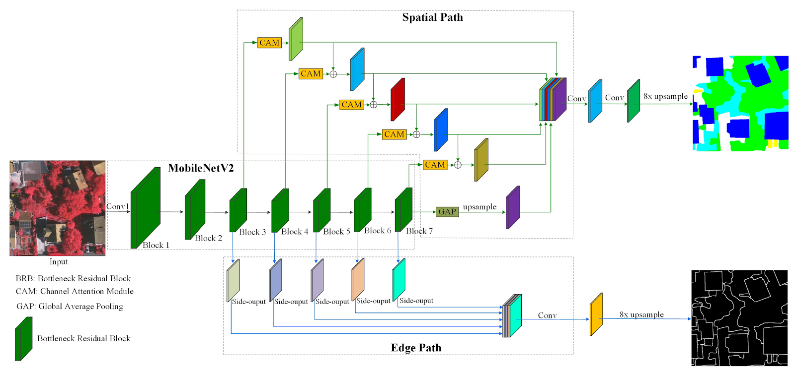

# KNN - Semantic segmentation on aerial images

The aim of this project is to implement method using deep learning framework pytorch from scratch.

We have chosen semantic segmentation on aerial high resolution images. Our inspiration is following article:
 [iSAID: A Large-scale Dataset for Instance Segmentation in Aerial Images](https://openaccess.thecvf.com/content_CVPRW_2019/papers/DOAI/Zamir_iSAID_A_Large-scale_Dataset_for_Instance_Segmentation_in_Aerial_Images_CVPRW_2019_paper.pdf)

## ! Colab notebooks
We experimented mainly in collab notebooks but unfortunately because of their size we could not upload them do IS so we add at least links:
1. FPN experiments: https://colab.research.google.com/drive/11qnb2qQy1STD4EmaCSp32i07n3GaBntL?usp=sharing
2. Dual-path experiments and implementation: https://colab.research.google.com/drive/12GLgTFEptUO4HsU-hvAXK86OiR1ywUfC?usp=sharing

## Dataset
We chose dataset [iSAID](https://captain-whu.github.io/iSAID/) containing 15 categories in 2806 high resolution images.
Characteristic about dataset:
- large number of images with high spatial resolution,
- large number of instances per category,
- large count of labelled instances per image, which might help in learning contextual information,
- huge object scale variation, containing small, medium and large objects, often within the same image,
- Imbalanced and uneven distribution of objects with varying orientation within images, depicting reallife aerial conditions,
- several small size objects, with ambiguous appearance, can only be resolved with contextual reasoning,
- precise instance-level annotations carried out by professional annotators.

### Classes
15 classes: *plane, ship, storage tank, baseball diamond, tennis court, basketball court,ground track field, harbor, bridge, large vehicle, small vehicle, helicopter, roundabout, swimming pool, soccer ball field*

### Preprocess
The dataset is based on [DOTA-v1.0](https://captain-whu.github.io/DOTA/dataset.html). It causes that some parts of the dataset are split over the net.
For this purpose the *dataset_preparator.py* script was created. It downloads the dataset from for DOTA-v1.0 and iSAID files and merges them together into following structure:
```shell
data/
├── test
│   ├── images
│   │   ├── P0006.png
│   │   ├── P0009.png
│   │   │   ...
│   │   ├── P2803.png
│   │   └── P2806.png
│   └── test_info.json
├── train
│   ├── images
│   │   ├── P0000_instance_color_RGB.png
│   │   ├── P0000_instance_id_RGB.png
│   │   ├── P0000.png
│   │   ├── P0001_instance_color_RGB.png
│   │   ├── P0001_instance_id_RGB.png
│   │   ├── P0001.png
│   │   │   ...
│   │   ├── P0826_instance_color_RGB.png
│   │   ├── P0826_instance_id_RGB.png
│   │   ├── P0826.png
│   │   └   ...
│   └── iSAID_train.json
└── val
    ├── images
    │   ├── P0003_instance_color_RGB.png
    │   ├── P0003_instance_id_RGB.png
    │   ├── P0003.png
    │   ├── P0004_instance_color_RGB.png
    │   ├── P0004_instance_id_RGB.png
    │   ├── P0004.png
    │   │   ...
    │   ├── P2802_instance_color_RGB.png
    │   ├── P2802_instance_id_RGB.png
    │   └── P2802.png
    └── iSAID_val.json
```
Where *instance_color picture* contains objects filled with the color which corresponds to class and 
*instance_id* contains the same objects but each one is filled with its own color.

Sizes of individual pictures are different and sometimes it is good to have pictures of the same size and smaller dataset in general (to save some time). We created a batch of support classes
which propose list the dataset and create a subset of it.

- <b>Cropper</b> class is responsible for a cropping of individual images (original, instance_color and instance_id) in one time.
- <b>Couch</b> class iterates and lists the downloaded dataset.
- <b>SubsetCreator</b> class (located in *subset_prepator.py*) creates a subset of the dataset. Each picture is cropped by the Cropper class to 
      specified size. It creates a new folder with following structure:
```shell
tmp-data-500x500-from-10-pictures/
├── classes
│   ├── P0012-10.png
│   ├── P0012-11.png
│   │   ...
│   └── P2477-9.png
├── objects
│   ├── P0012-10.png
│   ├── P0012-11.png
│   │   ...
│   └── P2477-9.png
├── origin-classes-v-join
│   ├── P0012-10.png
│   ├── P0012-11.png
│   │   ...
│   └── P2477-9.png
├── origin-objects-v-join
│   ├── P0012-10.png
│   ├── P0012-11.png
│   │   ...
│   └── P2477-9.png
└── origins
    ├── P0012-10.png
    ├── P0012-11.png
    │   ...
    └── P2477-9.png
```
This subset was created from 10 pictures randomly selected from dataset. They were cropped into 500x500px sizes.
- *classes* folder contains *instance_color* pictures
- *objects* folder contains *instance_id* pictures
- *origin-classes-v-join* folder contains *origin_picture* horizontally concatenated *instance_color* pictures
- *origin-objects-v-join* folder contains *origin_picture* horizontally concatenated *instance_id* pictures
- *origins* folder contains *origin* pictures

## Model description

The model is based on article A Dual-Path and Lightweight Convolutional Neural Network for High-Resolution Aerial Image Segmentation which can be found here https://www.mdpi.com/2220-9964/8/12/582/htm#B35-ijgi-08-00582

The model is composed of 3 individual parts: Backbone, Spatial and Edge. Each part is implemented in a separated class. The classes for paths can be found in modelParts.py file. The class DualPath connects ale individual parts together and determine how forward method is applied at all. 

The code is written to enable changing the backbone model freely as much as possible. 

The backbone class has to return the list of tensors as sides outputs from its forward method which are applied in spatial path then by side with .

In the init method of DualPath class the configuration of spatial path block has to be proposed.



## Metrics
We support two metrics now:
- structural similarity index (from *scikit-image* package)
- Intersection-over-union (IoU) - the value is <0,1> and 1 means perfect match, it is counted *(overlap_area/total_area)*, where 
  *overlap_area* is number of pixels where the images has any class 
  and *total_area* is number of pixels occupied by class in at least 
  one picture (the reference or the result)
  
They are located in the *couch.py* script. 

## Experiments
No experiments yet. Will be added.

## Tested on Machine


## Presentation
Our presentation about mentioned article can be found here: https://docs.google.com/presentation/d/1cBXyMrgEnFJvOHBkU_BKvDhDyDyQQxjUAyUr-Oe0hIQ/edit?usp=sharing 
Our final presentation is found here: https://docs.google.com/presentation/d/1HUXtq30Rq4zjJ8kr94cnyHaob4UhszvMRCkqoL0OicI/edit?usp=sharing


### Authors
- Alena Tesařová (xtesar36@stud.fut.vutbr.cz)
- Petr Kohout (xkohou14@stud.fit.vutbr.cz)
- Pavel Kohout (xkohou15@stud.fit.vutbr.cz)

### Source
https://gitlab.com/xkohou15/KNN_segmentation/-/tree/master